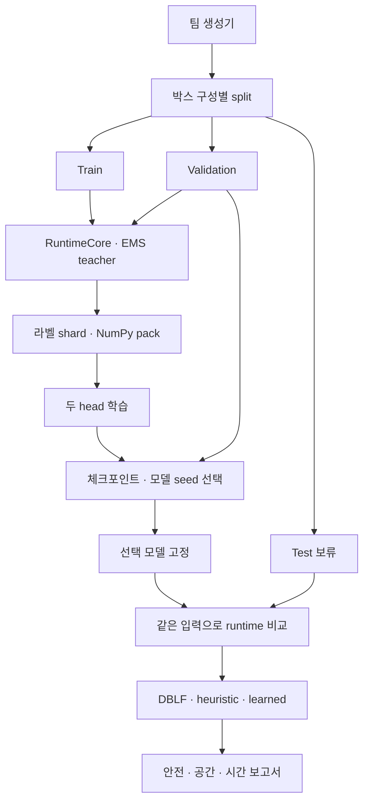

# 동한 5-③~⑥ 모델 학습·runtime 검증 v2

목적은 생성기 박스 수를 늘려 학습하고, 최신 `TeamRuntimeRanker`에서
DBLF·heuristic·학습 모델을 같은 입력으로 비교하는 것이다. Stage 4 PPO의
`proxy + DBLF value_provider`, 버퍼 4칸 계약은 유지한다.

## 무엇을 바꾸었는가

| 파일 | 변경 이유 |
|---|---|
| `scripts/donghan/model_pipeline.py` | 데이터 생성·수집·학습·평가를 각각 실행하거나 한 번에 실행 |
| `pac_planning/model_pipeline.py` | 실제 팀 RuntimeCore의 measured state를 활용하고 여러 프로세스로 episode 처리 |
| `pac_planning/team_training.py` | runtime에서 full ordered list를 반환하는 EMS teacher 및 cache 계약 검사 |
| `pac_planning/training_data.py` | episode별 압축 라벨, 무결성 검사, disk-backed NumPy 배열 |
| `pac_planning/training.py` | query minibatch Adam, validation 조기 종료, 중단 후 재개, warm start |
| `pac_planning/model.py` | LambdaRank pair 연산을 벡터화하고 기존 inference JSON 스키마 유지 |
| `pac_planning/evaluation.py` | safety-first Top-K 진단, 같은 episode의 paired 비교, inventory 단위 신뢰구간 |
| `config/model_*.yaml` | 실행량·학습량·rollout·평가 조건을 명시 |

모델의 역할은 후보 순위와 미래 결과 추정이다. 실제 EMS·hard mask·로봇 검사는
팀 backend가 담당한다. 입력 45차원과 두 head의 의미는 기존 계약을 유지한다.
학습 pack은 디스크 사용량을 줄이기 위해 float32이며, Adam의 파라미터·moment·
minibatch 계산은 float64다. hard geometry 검사는 pack의 반올림값을 사용하지 않는다.



Validation은 checkpoint·seed 선택에만 사용한다. Test 결과로 가중치나
모델을 다시 선택하면 해당 test는 다음 실험부터 validation으로 취급하고
새 독립 test를 만들어야 한다. `--external-dataset`은 새로운 생성기 데이터의
전체 inventory를 기존 train/validation inventory와 대조한 뒤 평가한다.

## 데이터가 늘어나는 방법

`sample_per_family`를 늘리면 normal, size_mixed, weight_mixed, late_large,
late_heavy, repeated_sku의 새 시나리오가 늘어난다. `boxes_per_scenario`를
늘리면 높게 쌓인 후반 상태가 늘어난다. `episode_seeds`는 측정·누락·상태
경로를 다양화하며, 새 독립 inventory 수로 계산하지 않는다.

| preset | 원본 시나리오 | 원본 박스 | 수집 pass | hidden | rollout |
|---|---:|---:|---:|---:|---|
| `model_development.yaml` | 36 | 864 | 1 | 64 | horizon 2, scenario 3 |
| `model_benchmark.yaml` | 180 | 14,400 | 3 | 128 | horizon 3, scenario 7 |

후자의 43,200개는 source 박스의 **관측 반복 노출** 수다. 고유 원본 박스 수는
14,400개다. query 수·후보 라벨 수는 실제 도달한 상태에 따라 달라지며
`collection_summary.json`에 기록된다. Benchmark preset 전체는 별도 장시간
학습용 설정이며 실행 결과를 확인하기 전에는 성능이 개선됐다고 말할 수 없다.

미래 도착 순서·실제 숨겨진 강도는 simulator와 사후 audit만 사용한다.
ranker는 measured snapshot, catalog/remaining counts와 EMS evidence를 받는다.
teacher는 알려진 분포에서 rollout하며 실제 뒤에 오는 정답 순서를 보지 않는다.

## 실행 환경

Ubuntu 22.04 + Python 3.10을 기준으로 한다. 아래 학습·평가에는 ROS2를
실행할 필요가 없다. worker는 Linux `fork`를 사용하며 ROS/controller를 띄우지 않는다.

```bash
sudo apt update
sudo apt install -y python3-pip python3-venv
python3 -m venv .venv-model
source .venv-model/bin/activate
python3 -m pip install numpy pyyaml pytest
```

CPU에서 worker가 여러 개일 때 BLAS thread가 중복되지 않도록 실행 앞에
`OPENBLAS_NUM_THREADS=1 OMP_NUM_THREADS=1`을 붙이는 것이 좋다.

세 checkout을 준비한다.

- 동한: 본 코드가 있는 checkout (`scripts/donghan/model_pipeline.py` 기준 root)
- 팀장: `claude/pensive-pasteur-dwbu3g`, 이번 기준 `81d0333...`
- 생성기: `feature/jaesung-dataset-generator`, 기준 `cc4c075...`

처음 준비하는 경우 Ubuntu 터미널에서 다음처럼 서로 다른 폴더에 받는다.
이미 해당 checkout이 있다면 같은 폴더에 다시 clone하지 않는다.

```bash
mkdir -p ~/AHEAD
cd ~/AHEAD
git clone --branch feature/donghan-placement-planner --single-branch \
  https://github.com/yang8988/pac-mission1-shared.git pac-donghan
git clone --branch claude/pensive-pasteur-dwbu3g --single-branch \
  https://github.com/yang8988/pac-mission1-shared.git pac-team
git clone --branch feature/jaesung-dataset-generator --single-branch \
  https://github.com/yang8988/pac-mission1-shared.git pac-generator
git -C pac-team checkout 81d0333ba6550d9ee6f02661d8b8d9e79beaca6c
git -C pac-generator checkout cc4c075daa3dd4c7f80510042732763fc9502933
```

동한 checkout에 ZIP의 원격 786004 기준 패치를 적용한 다음,
`cd ~/AHEAD/pac-donghan/pac-mission1-shared`에서 venv와 아래 실행 절차를
진행한다. 패치 적용 절차는 ZIP의 `README_APPLY_KO.md`에 있다.

생성기 root는 `tools/ahead_dataset_generator`이다. 시뮬레이터의 다른
`pac_common/pac_planning`을 이 Python 환경의 앞 경로에 넣지 않는다.
CLI는 동한의 `pac_common/pac_planning`과 팀장의 candidate/highlevel/runtime/
robot_check를 명시적으로 연결한다.

## 작은 실험부터 끝까지

동한 root에서 다음을 실행한다. `--output`은 실험마다 새 경로를 사용한다.

```bash
python3 scripts/donghan/model_pipeline.py all \
  --team-root ~/AHEAD/pac-team \
  --generator-root ~/AHEAD/pac-generator/pac-mission1-shared/tools/ahead_dataset_generator \
  --generator-ref cc4c075daa3dd4c7f80510042732763fc9502933 \
  --config config/model_development.yaml \
  --output experiments/development
```

14,400 원본 박스 설정으로 확대하려면 **새 output**에서 다음을 실행한다.
수집 3 pass/모델 seed 3개가 포함되어 작은 실험보다 오래 걸린다. 이번
제공본에서 이 큰 설정을 실행한 결과는 없다.

```bash
OPENBLAS_NUM_THREADS=1 OMP_NUM_THREADS=1 \
python3 scripts/donghan/model_pipeline.py all \
  --team-root ~/AHEAD/pac-team \
  --generator-root ~/AHEAD/pac-generator/pac-mission1-shared/tools/ahead_dataset_generator \
  --generator-ref cc4c075daa3dd4c7f80510042732763fc9502933 \
  --config config/model_benchmark.yaml \
  --output experiments/benchmark_14400 --workers 4
```

stage를 나누어 실행하려면 첫 인자만 `generate`, `collect`, `train`,
`evaluate`로 바꾼다. `--dataset /existing/dataset`으로 팀장이 만든
dataset80 또는 다른 생성기 결과도 사용할 수 있다.

정상 출력은 `Generated ... scenarios`, `collected ... queries/candidates`,
각 epoch의 validation 값, `evaluated ...` 로그 순서다. 데이터가 크면
전체 teacher rollout 때문에 수집이 오래 걸린다. 모델 크기보다 teacher의
horizon/scenario_count가 라벨 수집시간에 큰 영향을 준다.

```bash
# 완료된 shard는 계약·SHA가 같으면 다시 계산하지 않음
python3 scripts/donghan/model_pipeline.py collect \
  --team-root /path/to/leader-checkout --dataset /path/to/dataset \
  --generator-ref cc4c075daa3dd4c7f80510042732763fc9502933 \
  --config config/model_development.yaml --output experiments/development

# 같은 데이터·optimizer·Python/NumPy 환경에서 총 epoch 목표까지 이어감
python3 scripts/donghan/model_pipeline.py train \
  --team-root /path/to/leader-checkout --dataset /path/to/dataset \
  --config config/model_development.yaml --output experiments/development \
  --resume --epochs 200
```

수집 재개에는 최초 실행과 같은 dataset·source ref·설정·코드가 필요하다.
`--dataset`으로 다시 실행할 때도 최초 `--generator-ref`를 유지한다.
코드나 설정을 수정했다면 새 output에서 수집한다. 기존 완료 pack은
`train` 명령으로 읽을 수 있으며 원래 수집 manifest를 덮어쓰지 않는다.

조기 종료한 동일 데이터에서 epoch 목표만 높여도 추가 학습은 일어나지 않을
수 있다. 새로운 데이터를 사용하려면 새 output으로 generate/collect 후
`train --initial-model /old/run/selected_model.json`을 사용한다.
hidden 폭과 candidate backend가 같아야 하며 이전 held-out inventory를
train에 넣으면 거절한다. `--resume`과 `--initial-model`은 함께 쓰지 않는다.
Benchmark preset은 hidden 128이므로 hidden 64 모델의 warm start 대신
새 모델을 학습해야 한다.

## 검증 1: 최신 runtime 연결 비교

같은 scenario·seed·variant에서 다음 네 가지를 비교한다.

| mode | 저수준 순위 | rollout | Stage 6 |
|---|---|---|---|
| `dblf` | 기존 DBLF | 없음 | 기존 robot checker |
| `heuristic_rollout` | deterministic score | 있음 | 동일 |
| `learned_ranking` | 학습된 rank/future head | 직접 rollout 없음 | 동일 |
| `learned_rollout` | 학습된 shortlist | 있음 | 동일 |

`stream_sha256`으로 동일 박스·현장 이상 입력을 확인하고,
`ranker_provenance.ems_verified`로 real EMS 경로를 확인한다.
planner가 탈락시킨 후보를 다시 DBLF 후보로 붙이지 않는다.

로그/결과는 다음과 같다.

- `runtime_test/report.json`: 전체 비교·seed 결과·paired CI·배포 판단
- `runtime_test/episodes/`: episode별 지표·planner latency·EMS/모델 상태
- `runtime_test/layouts/`: 각 팔레트 배치·사후 검사 및 이벤트
- `model_selection.json`: validation만 사용한 모델 선택 근거
- `models/seed_*/history.json`, `checkpoint.json`: 학습 진행·재개 파일

정책이 서로 다른 행동을 선택하면 executor의 난수 소비 순서도 달라질 수
있다. 동일 stream과 configured seed는 보장하지만, 모든 행동에 같은
실행오차가 붙는 실험은 아니다. `clean` variant는 실행오차를 제거하며
`nominal`, `noisy3mm`는 여러 seed의 차이를 함께 본다.

## 검증 2: 보지 않은 데이터와 반복 seed

원래 데이터의 effective test split은 학습/모델 선택에 사용하지 않는다.
`clean`, `nominal`, `noisy3mm` 각각에서 여러 seed를 반복하고, 같은
inventory의 반복을 하나의 cluster로 묶어 95% bootstrap 구간을 계산한다.

새 데이터 전체를 별도로 평가하려면 다음을 실행한다.

```bash
python3 scripts/donghan/model_pipeline.py generate \
  --team-root /path/to/leader-checkout \
  --generator-root /path/to/generator-checkout/pac-mission1-shared/tools/ahead_dataset_generator \
  --generator-ref cc4c075daa3dd4c7f80510042732763fc9502933 \
  --config config/model_fresh_evaluation.yaml --output experiments/fresh

python3 scripts/donghan/model_pipeline.py evaluate \
  --team-root /path/to/leader-checkout \
  --config config/model_fresh_evaluation.yaml --output experiments/development \
  --external-dataset experiments/fresh/source_dataset --report-name runtime_fresh
```

평가는 팔레트 수만 보지 않는다. 처리 박스·처리 부피가 줄어 팔레트 수가
작아지는 결과를 우수 모델로 판정하지 않는다. L4·true layout의 하중/안정성/
겹침/돌출·model fallback·EMS 누락도 함께 검사한다. 독립 inventory 10개 미만,
안전 이상 발생, 처리량 감소 또는 paired CI에서 공간 이득이 불명확하면
`KEEP_BASELINE`을 남긴다. 이 offline gate는 ROS/물리 검증을 대체하지 않는다.

## 코드 회귀 검사

동한 프로젝트 root에서 경로를 맞춘 뒤 실행한다. pytest가 없다면 위 venv의
`python3 -m pip install pytest`를 먼저 실행한다.

```bash
AHEAD_MODEL_ROOT="$PWD"
AHEAD_TEAM_ROOT=/path/to/leader-checkout
PYTHONPATH="$AHEAD_MODEL_ROOT/ros2_ws/src/pac_common:$AHEAD_MODEL_ROOT/ros2_ws/src/pac_planning:$AHEAD_TEAM_ROOT/ros2_ws/src/pac_candidates:$AHEAD_TEAM_ROOT/ros2_ws/src/pac_highlevel:$AHEAD_TEAM_ROOT/ros2_ws/src/pac_robot_check:$AHEAD_TEAM_ROOT/ros2_ws/src/pac_runtime:$AHEAD_TEAM_ROOT/tools/virtual_data" \
  python3 -m pytest -q -rs

cd "$AHEAD_TEAM_ROOT"
PAC_COMMON_SRC="$AHEAD_MODEL_ROOT/ros2_ws/src/pac_common" \
PAC_PLANNING_SRC="$AHEAD_MODEL_ROOT/ros2_ws/src/pac_planning" \
PYTHONPATH="$AHEAD_MODEL_ROOT/ros2_ws/src/pac_common:$AHEAD_MODEL_ROOT/ros2_ws/src/pac_planning" \
  python3 -m pytest -q -rs
```

팀 테스트는 `PAC_COMMON_SRC`를 직접 확인하므로 PYTHONPATH만 추가해서는
수집 단계에서 실패할 수 있다. 선택적 simulator/SB3 의존성이 없으면 관련
검사는 skip된다. 이 검사는 Python 계약·알고리즘·bridge 회귀 검사이며
로봇이 움직인 증거가 아니다.

## ROS 실행 경로

별도 `team_runtime_after_81d0333.patch`에는 `ranker_model_path`와 함께
`ranker_config`를 받는 launch/node 연결이 들어 있다. 새로운 h2/s3 모델에
기본 h3/s7 설정을 사용하면 계약이 다르므로 model fallback이 발생한다.

```bash
ros2 launch pac_runtime gazebo_cell.launch.py \
  repo:=/path/to/leader-checkout ranker:=donghan \
  ranker_model_path:=/path/to/experiment/selected_model.json \
  ranker_config:=/path/to/experiment/planner_config.yaml
```

이 명령은 ROS2에서 검증되지 않았다. 새 모델은 실험 후보이며 배포 기본값을
자동으로 바꾸지 않는다. 현 Gazebo driver의 시간 기반 성공 처리와
흡착 attach/detach·MoveIt 부재도 그대로 남아 있다.

## 확인된 개발 과정

- 첫 병렬 수집에서 immutable `FrozenDict`의 pickle 복원이 차단됐다.
  Ubuntu offline worker를 `fork`로 실행하여 snapshot 불변성을 유지했다.
- 체크포인트 재개 테스트에서 초기 future bias가 float32였고 복원 시 float64가
  되어 미세한 차이가 났다. 초기부터 float64로 통일한 뒤 동일 결과를 확인했다.
- teacher cache가 backend config 검사보다 먼저 반환되는 경로를 발견했다.
  cache hit에서도 backend contract를 먼저 검사하도록 수정했다.
- 여러 수집 pass에서 동일 snapshot의 Monte Carlo 정답이 달라질 수 있다.
  snapshot ID만으로 제거하지 않고 query 전체 내용이 같은 경우만 중복으로
  처리하도록 보완했다. 서로 다른 정답 표본은 유지하고, 독립 inventory 수는
  늘리지 않는다. 기존 실행 데이터의 array를 다시 pack해 동일 byte를 확인했다.

새 데이터 S0002/seed 201의 학습 순위 episode를 별도로 프로파일링했다.
58회의 모델 `predict` 누적 시간은 약 0.027초였고, 후보 1,046개의
`compute_features`는 약 66.14초였다. 그 안에서 현재 후보를 놓은 뒤
잔여 SKU/버퍼를 탐색하는 `has_placement`가 8,076회 호출됐다. 같은
입력 stream과 최종 layout/decision hash가 기존 평가 episode와 일치했다.
다른 worker가 실행되는 동안의 프로파일이며 단독 실행 지연 벤치는 아니다.
다음 속도 개선 대상은 이 feature probe의 후보 생성 반복이다. 검사 조건을
생략하지 않고 exact snapshot cache 또는 팀 backend의 existence-query API를
검토해야 한다. 이번 제공본은 feature 의미와 teacher 라벨을 유지한다.

아직 uncertain 박스의 선언된 XY 필요 여유 6.025 mm에 비해 팀 mask 설정은
4 mm다. 모델 학습으로 이 geometry 조건을 해결할 수 없으므로 실험 보고서의
측정 오차 진단과 L4/audit 결과를 함께 검토해야 한다. 팀 mask 설정을
임의로 바꾸지 않고 위험을 수치로 남긴다.
