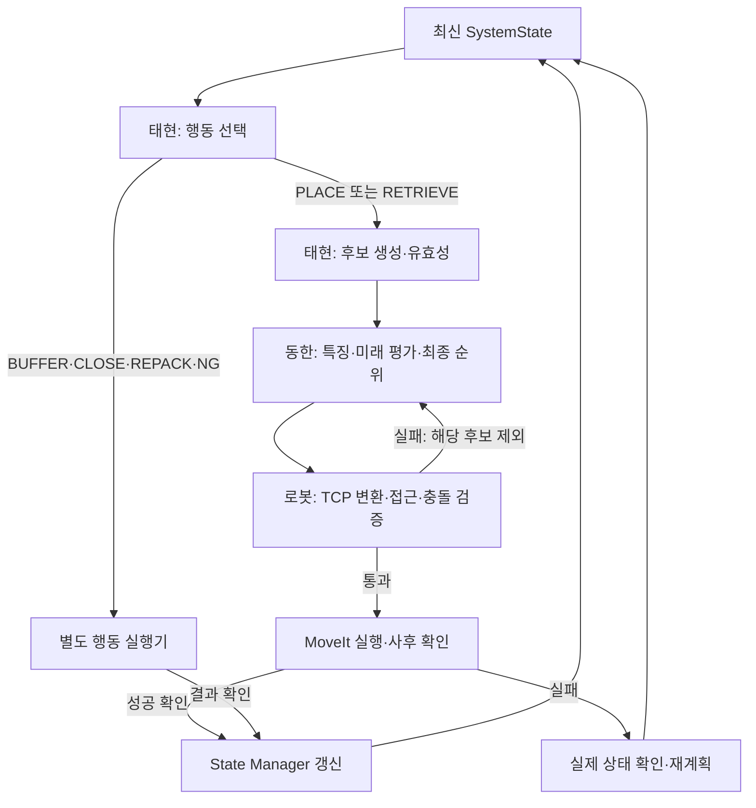

# 대회 전 회의 자료: 이동한 5-③~⑥과 팀 통합

## 2026-10-08 23:40 최신 연결

태현 `e8674da4`에 1~8 runtime과 HDR50-22 해석 기반 6단계가 추가됐다.
동한 쪽에는 실제 EMS와 모델 fingerprint를 유지하는 `TeamRuntimeRanker`와 7개 패키지
workspace 구성을 추가했다. 단일 박스 Python chain까지 통과했지만 ROS2/MoveIt/실제 실행은 아니다.
팀 runtime의 기존 donghan 경로 EMS 우회와 stale 실행 결과 적용 문제는 별도 소형 upstream 패치로 제공한다.
세부 결과는 `integration_check_20261008_2340.md`를 따른다.

## 최신 상태 — 2026-10-08 후속 점검

- 동한 원격 `7860043`에 실제 EMS teacher 기반 학습 연결·실험 모델이 게시됐다. 새 모델을 기본값으로 채택하지 않았다.
- 태현 최신 `e75e274`에 PyTorch/sb3 MaskablePPO 모델과 정규화 sidecar가 게시됐다. test 27회에서 Rule 4.09, sb3 4.23 팔레트 상당량(낮을수록 좋음)으로 보고하여 Rule 기본값을 유지한다.
- 이번 로컬 NumPy 정책 snapshot 인계 검사와 실제 후보/backend 모델 계약은 통과했다. sb3는 metadata 정적 검사만 실행했고, PyTorch 추론은 이 환경에서 실행하지 않았다.
- 동한 Python 패키지 두 곳의 잘못된 ament_python buildtool_depend를 제거했다. build_type은 유지한다. ROS2에서 rosdep/build/launch를 실행한 것은 아니다.
- 자세한 변경·실행 명령·검증 한계는 integration_check_20261008_2118.md를 참조한다. 아래 설명·표는 당시 회의/개발 기록이며 원격 최신 상태와 구분한다.


## 1분 설명 대본

제가 맡은 부분은 후보 위치를 새로 만드는 것이 아니라, 태현님이 만든 후보와 유효성
검사 결과를 받아 그중 어느 위치가 좋은지 고르는 부분입니다. 후보별 안정성·공간·하중
여유·미래 박스 적합도·시간 비용을 계산하고, 앞으로 들어올 박스를 가상으로 놓아본 뒤
최종 후보 순위를 반환합니다. 현재 연결 기본값은 학습 모델을 강제로 쓰지 않는
휴리스틱과 look-ahead이고, 기존 AI 모델은 실제 팀 후보 생성기에서 추가 검증이 필요합니다.

오늘 게시한 브랜치에는 실제 EMS 연결, 좌표 변환, ROS 계획 service 코드와 테스트가
들어 있습니다. 태현님이 새로 만든 HighLevelDecider의 실제 상태 입력과 현재/버퍼 박스
인계도 이번 추가 패치에서 확인했습니다. 추가 보완 후 전체 61개 검사가 통과했고,
5박스 가상 적재가 실행됐습니다. 이것을 실제 로봇 적재 성공이라고 설명하지는 않습니다.

지금 가장 필요한 것은 MoveIt으로 pick/place하는 부분과, 성공을 확인한 후 상태를
갱신하는 부분입니다. 저는 계획 service와 후보·버전·좌표 연결을 맡고, 회의에서 로봇
실행 담당과 State Manager 담당을 확정하면 단일 박스부터 전체 흐름을 연결할 수 있습니다.

## 확인 기준

| 대상 | 기준 커밋 |
|---|---|
| 동한 원격 게시본 | 146797e337d9b17c521b3ddb1b8560453cddb1bf |
| 태현 최신 실제 상태 입구 | 1a4cf67a51de763a0c569ed2f2bce7a3e87180b8 |
| shared generator | cc4c075daa3dd4c7f80510042732763fc9502933 |
| shared physics | 7f4ae37621ea20527c09a707390db9b0f1317aa3 |
| 별도 ahead main | fa3115a903117eeb57009defd12a201d5290345d |
| ahead 서브모듈 수정 브랜치 | 0c8fb80f5674e6202489209a743f8b82ce915262 |
| shared main | 1eb10252ffcbd47b1b9f24990aa6e9e5f523a0a4 (제목 수준) |

최신 태현 실제 상태 입구는 2026-10-08 18:00:05 KST 추가됐다.
동한의 19개 개발 파일은 18:18:23 KST 게시됐다.
이 ZIP의 이번 추가 수정은 위 동한 원격 게시본 이후의 로컬 패치이며 아직 원격 미반영이다.
기존 TeamPlacer/scene_bridge/ROS service는 게시됐고, 0N 검토용 패치 파일도 게시됐다.
단, 실제 물리 저장소에 0N 수정이 적용됐다는 뜻은 아니다.

## 담당 간 연결 흐름



이 그림은 목표 실행 흐름이다. 로봇 실행·사후 확인·실제 상태 commit은 미완료다.
5-③~⑥에서 만드는 가상 상태는 실제 State Manager 버전을 증가시키지 않는다.

| 파트 | 입력 → 출력 | 현재 연결 상태 |
|---|---|---|
| 재성 데이터 | 박스/팔레트 설정 → 원천 데이터 | 태현 가상데이터 정규화 경로로 5박스 재생 확인 |
| 태현 4번 | SystemState → 행동·대상 box·state_version | HighLevelDecider 추가; Python 함수 상태 |
| 태현 5-①/② | box/state/context → 후보·ValidationResult/evidence | 실제 EMS/LBCP callback 연결 검증 |
| 동한 5-③ | 후보와 evidence → 45개 특징 | 구현·검사. 1개 중복 특징은 모델 호환성 때문에 유지 |
| 동한 5-④ | 특징 → 후보 우선순위/Top-K | AI 모델 코드와 기존 모델은 존재; 팀 backend 기본은 모델 없는 휴리스틱 |
| 동한 5-⑤ | Top-K + 잔여재고/preview → 미래 rollout 성과 | deterministic seed·공통 시나리오·상태 불변 검사 |
| 동한 5-⑥ | 현재/미래 평가 → 최종 순위·점수 항 | 구현·검사; 로봇 검증을 반드시 추가해야 함 |
| 재성 작업셀/물리 | 장면·박스 pose → 렌더/물리 상태 | 자산 존재; 단일 Bullet 안정화 검사 실행 |
| 로봇/상태 실행 루프 | PLANNED → execute → ACTUAL snapshot | 실제 MoveIt backend·사후 commit 연결 필요 |

4번은 "어떤 박스·어떤 행동"을 고르고, 동한 파트는 "그 박스를 어디에 놓을지" 고른다.
HighLevelDecision.candidate는 행동 가능성의 참고 자세다. 그 한 개만 평가하지 않고
5단계에서 전체 후보를 다시 생성해 EMS와 함께 비교한다.

## 현재 부족한 점과 이번 보완

1. 특징 계산의 has_placement가 앞 16개를 먼저 잘라 가능한 17번째 후보를 놓쳤다.
   생성기가 제공한 유한 후보를 검사하다 첫 유효 후보에서 멈추도록 수정했다.
   더 많이 검사할 수 있으므로 속도가 개선됐다고 주장하지 않는다.
2. 후보 하나의 잘못된 EMS가 전체 plan을 ValueError로 중단했다.
   해당 후보를 FEATURE_INPUT_INVALID로 기록·제외하고 나머지는 평가하도록 수정했다.
3. 실제 상태에서 새 4번 결정을 넘기는 경로가 명시돼 있지 않았다.
   plan_high_level_decision으로 행동 종류·정확한 box·state_version을 검사하고 실제 EMS로 연결했다.
4. 후보×SKU 프로브는 soft budget 전에 계산될 수 있다. 팀 문서의 1초 초과 6/24는
   팀 측 보고이며 이번에 재측정하지 않았다. strict deadline이나 실시간 제어기로 쓰지 않는다.
5. 시간 점수는 이동거리 기반 대용값이다. 실제 HDR50-22 trajectory 시간·실패 비용 측정이 없다.
6. 기존 저수준 학습은 ReferenceBackend 기준이다. 실제 EMS/LBCP 데이터로 학습·holdout 평가가 필요하다.
7. 안전 여유를 먼저 비교하고, 포화 이후 종합 점수를 비교한다. 가중치만 임의 조정하면
   순위가 기대대로 바뀌지 않을 수 있다. 비교 실험 뒤 조정한다.

이번 실제 수정 파일:
- ros2_ws/src/pac_planning/pac_planning/features.py
- ros2_ws/src/pac_planning/pac_planning/planner.py
- ros2_ws/src/pac_planning/pac_planning/team_bridge.py
- scripts/donghan/stage_planner_workspace.py (`--include-highlevel` 추가)
- tests/test_meeting_regressions.py, tests/test_highlevel_handoff.py
- docs/requirements_traceability.md, 이 회의 자료

팀 리뷰의 "동한 ROS 없음/실제 EMS 미연결" 일부 문구는 구버전 fe1e135 기준이다.
현재는 service 코드가 게시됐고 EMS 연결은 Python으로 검증됐다. ROS 실행 성공은 아직 아니다.

## 오늘 확인한 결과

- 추가 수정 전 코드에 새 회귀 검사를 넣어 2개 실패를 재현했다.
- 수정 후 전체: 61 passed, 9.11초. Bullet solid/slatted 안정화 2개와 0N 기능 검사 1개 포함.
- 태현 최신 테스트: 170 passed, 2 skipped, 50.83초. gymnasium/torch 미설치로 선택 검사 미실행.
- 새 HighLevelDecider → 동한 평가기: PLACE_CURRENT/RETRIEVE_BUFFER 각 1개 통과;
  오래된 버전/수정된 box 거부와 실제 상태 불변 포함.
- Rule + TeamPlacer + S0001 앞 5개: 5/5 가상 배치, NG 0, 기하 safety issues 0.
  로그의 40초는 가정 비용이다. 실제 로봇 시간 측정이 아니다.
- --include-highlevel로 중복 없는 5패키지 작업공간 준비를 실행했다. colcon build는 실행하지 않았다.
- Ubuntu 24.04/Python 3.10.22에서 검증. ROS2 Humble/MoveIt/실제 로봇 실행은 미검증.

## ROS2/MoveIt 연결 순서

### 1. 실행 환경과 패키지 소유권

Ubuntu22.04/Humble을 실제 실행 PC 기준으로 고정한다. 같은 이름의 pac_common/pac_planning
두 벌을 같이 빌드하지 않는다. 현재 별도 ahead 저장소와 동한 저장소의 동일 이름 패키지는
내용이 다르다. 공통 데이터형은 동한 것을 단일 기준으로 하고, 다른 코드에는 adapter를 둔다.
버퍼는 high-level 설정과 PlanningContext.buffer_capacity를 동일하게 공급한다.

### 2. 계획 service를 실제로 띄우기

```bash
# 두 변수는 각각 별도 checkout 경로로 지정
# PAC_PLANNER_ROOT = 동한 checkout/pac-mission1-shared
# PAC_TEAM_ROOT = 태현 checkout
source /opt/ros/humble/setup.bash
python3 "$PAC_PLANNER_ROOT/scripts/donghan/stage_planner_workspace.py" \
  --team-root "$PAC_TEAM_ROOT" --include-highlevel --output "$HOME/ahead_planner_ws"
cd "$HOME/ahead_planner_ws"
rosdep install --from-paths src --ignore-src -r -y
colcon build --symlink-install
source install/setup.bash
ros2 launch pac_planning placement_planner.launch.py \
  candidate_config:="$PAC_TEAM_ROOT/config/taehyeon/candidates.yaml" \
  planner_config:="$PAC_PLANNER_ROOT/config/default.yaml" use_sim_time:=false
```

위 ROS 명령은 제안한 실행 절차이며 이 환경에서는 미실행이다. 출력 workspace는 새/빈 폴더여야 한다.
다른 터미널도 같은 setup을 source한 뒤 ros2 service list와
ros2 interface show pac_planning_interfaces/srv/PlanPlacement를 확인한다.
service 입력은 state_json/context_json/box_id/expected_state_version/seed다.
완료 기준은 실제 요청에서 ranked·탈락 이유를 받고 오래된 버전 요청이 거부되는 것이다.
pac_highlevel을 작업공간에 넣는 것만으로 stage-4 ROS 노드가 생기는 것은 아니다.

### 3. 로봇만 먼저 움직이기

공식 submodule의 확보된 모델/MoveIt config에서 planning group·joint names·TCP를 확인한다.
Home → 도달 가능한 한 자세 → Home의 계획과 실행이 먼저 성공해야 한다.
ROS 설치/URDF 표시만으로 성공 판정하지 않는다. ros2_control controller 상태와
FollowJointTrajectory action, /joint_states, TF, /clock 및 use_sim_time을 확인한다.
현재 ahead launch는 작업셀·로봇 spawn·control·clock용이다. 그 자체로 placement → MoveIt 실행이 아니다.

Humble에는 공식 MoveGroupInterface(C++) 예제가 있으므로 사용 가능한 기존 MoveIt 패키지에
작은 executor를 연결하는 방안을 우선한다. Python planner를 C++로 재작성할 필요는 없다.
Python 서비스/상위 노드가 실행 요청을 보내고 C++ executor가 plan/execute 결과를 반환하면 된다.

### 4. pose·scene·그리퍼

- planner pose는 팔레트 모서리 원점 기준 회전 AABB의 최소 모서리다.
- 박스 중심 → world TF → grasp transform → TCP pose로 변환한다. 중심이 곧 TCP는 아니다.
- Gazebo 1.2×1.0m와 Bullet 기본 1.1×1.1m를 공통 설정으로 통일한다.
- 생성기의 최대 높이 1.5m가 목재 0.15m를 포함한다면 적재 공간은 1.35m다.
- pallet/conveyor/기존 박스를 planning scene CollisionObject로 넣는다.
- pick 시 attached collision object, place 시 detach/world collision object로 바꾼다.
- MoveIt의 attach는 충돌 모델이다. Gazebo에서 실제로 박스를 붙잡는 그리퍼/부착 동작도 따로 필요하다.
- 코드상 명목 payload는 50kg이며 50N이 아니다. EOAT 질량·하중 중심·자세 제한까지 확인한다.
- Hdr50_22SimAdapter는 backend=None이면 거부한다. command_from_candidate는 지금 모서리 좌표를
  그대로 복사하므로 이 자리에 TF/TCP 변환을 연결해야 한다.

### 5. 단일 박스에서 연속 실행

Home → Pre-grasp → Grasp → Lift → Move → Pre-place → Place → Release → Retreat.
로봇 검증에서 1순위 후보가 실패하면 실패 이유와 ID를 기록하고 다음 후보 또는 재계획을 시도한다.
점수가 높다는 이유로 IK/충돌 실패를 무시하지 않는다.
place 성공과 실제 pose 확인 후 planning scene과 State Manager를 갱신한다.
실패 상태·중복 execution·오래된 후보를 검사한 뒤 state_version을 올린다.
예측 pose만 보고 성공 처리하면 안 된다. 그 후 5~10박스를 반복한다.

## 학습을 미리 해야 하는가

우선 Rule + 실제 후보/검사 + 휴리스틱/rollout으로 전체 실행을 확보한다.
기존 저수준 모델 없이도 동한 평가기가 동작한다. 새로운 RL 알고리즘 추가는 우선순위가 낮다.

태현의 PPO는 proxy+DBLF로 학습됐다. 2026-10-08 19:13:07 KST의 c6440576에서
수정된 환경의 NumPy PPO 재학습 모델과 평가가 게시됐다(최신 문서 HEAD 098251f9).
팀 보고서에서 Rule이 PPO보다 좋은 결과를 보였으므로 기본 운영은 Rule을 유지한다.
현재 게시 PPO는 77개 특징, 버퍼 4칸, proxy+DBLF 계약을 유지한다.
TeamPlacer를 실제 운영에 사용하면 DBLF와 placement·관측·전이가 달라진다.
기존 메타데이터만 고쳐 호환시키지 말고 Rule/PPO × DBLF/TeamPlacer를 분리 평가한다.
팀의 새 TeamPlacer 평가에 사용한 dual_head_ranker.json과 동한의 생성기 기반
team_fd683e56_smoke.json은 같은 모델이라고 가정하지 않는다. 후자의 새 PPO 연결 검사는
현재/버퍼 박스의 Python snapshot 전달만 검증했고, 여러 박스 정책 성능은 검증하지 않았다.

동한 저수준 AI는 실제 CandidateBackend와 동일 context/config로 teacher 라벨을 새로 수집한다.
실제 EMS를 공급하고 seed/horizon/scenario_count/가중치/feature schema/backend SHA를 기록한다.
기본 experiment.py는 ReferenceBackend를 사용하므로 기존 재학습 명령을 그대로 실행해도
팀 EMS용 모델이 되지 않는다. 현재 train_team_model.py에 실제 backend 수집 adapter가
연결됐고 team_fd683e56_smoke.json으로 소규모 실험을 실행했다. 이 후속 패치는 아직 원격
146797e에 반영되지 않았다. 자세한 실행/평가는 generator_model_training_20261008.md를 따른다.
박스 구성/시나리오 단위로 train/validation/holdout을 나누고 같은 구성의 순서만 바꿔 양쪽에 넣지 않는다.
학생 모델은 후보 선택 속도·실제 적재 성과를 휴리스틱 및 teacher와 비교하고 이득이 확인되면 쓴다.
차원이 같은 45개라고 해서 학습 분포나 안전성이 같다고 판단하지 않는다.

## 대회 전 필수 시험표

| 순서 | 시험 | 완료 기준 |
|---|---|---|
| P0-1 | Humble build + service 실제 요청 | 빌드/노드/요청 성공, 입력 버전·ranked 반환 |
| P0-2 | 로봇 단독 Home 왕복 | 실제 controller action 결과 성공·관절 상태 변화 |
| P0-3 | 고정 단일 박스 pick/place | 물리 박스 이동/해제·실제 pose 확인 |
| P0-4 | planner 1순위 → 로봇 | 모서리/중심/TCP 변환·장면 갱신·실제 commit |
| P0-5 | 여러 박스 | 5~10개 반복·중복 없음·각 결과 로그 |
| P0-6 | 필수 제약 | 경계/겹침/지지/0N/과하중/버전 오류 거부 |
| P0-7 | 예외 한 개 | 도달 불가나 실행 실패 → 다음 후보/재계획; 실패를 성공으로 기록하지 않음 |
| P1 | 정책·가중치·속도 비교 | 같은 시나리오·같은 조건에서 적재율/실패/시간 비교 |

Python 재현 명령 (추가 패치 적용 후, 실제 팀 checkout이 필요):

```bash
export PAC_COMMON_SRC="$PAC_PLANNER_ROOT/ros2_ws/src/pac_common"
export PAC_PLANNING_SRC="$PAC_PLANNER_ROOT/ros2_ws/src/pac_planning"
export PYTHONPATH="$PAC_COMMON_SRC:$PAC_PLANNING_SRC:$PAC_TEAM_ROOT/ros2_ws/src/pac_candidates:$PAC_TEAM_ROOT/ros2_ws/src/pac_highlevel"
cd "$PAC_PLANNER_ROOT"
python -m pytest tests/test_highlevel_handoff.py tests/test_meeting_regressions.py -q
python -m pytest -q -rs
cd "$PAC_TEAM_ROOT"
python -m pytest tests/taehyeon -q -rs
```

첫 명령 기대값은 4 passed다. 전체 61개에는 patched pac_simulation 의존성이 필요하며,
미설치 시 물리 검사는 skip된다. 환경 설정은 기존 team_integration_20261008.md를 참고한다.

## 회의에서 확정할 6개

1. 실행 PC/Ubuntu22.04/Humble/확보된 HDR50-22 모델과 EOAT.
2. 팔레트 크기·목재 높이·적재 높이·좌표 TF·버퍼 칸 매핑 단일 설정.
3. 재성: 확보한 작업셀 기반 MoveIt executor와 물리 pick/release 연결 (제안).
4. 태현: 4번 runtime의 ROS 호출 경계, buffer/close/repack/NG dispatcher와 정책 선택 (제안).
5. 동한: 5번 service와 데이터/EMS/좌표/버전 계약, 실패 후보 재계획 연결 (제안).
6. 실제 상태 commit·사후 검증의 총괄 담당을 별도로 지정하고 단일 박스 성공을 첫 공동 완료 기준으로 삼기.

시간이 부족하면 카메라 고도화/대규모 재학습/자동 재배치를 최소 데모 이후로 둔다.
센서 입력을 대신하는 데이터 입력을 사용하면 발표에서 그 입력의 출처를 명시한다.
물리로 박스를 실제 움직이고 확인한 데모와 좌표/계획만 보여주는 데모를 구분한다.

## 소스와 공식 실행 참고

- [동한 게시본](https://github.com/yang8988/pac-mission1-shared/commit/146797e337d9b17c521b3ddb1b8560453cddb1bf)
- [태현 변경 비교](https://github.com/yang8988/pac-mission1-shared/compare/e7ed1f93fa617d9b61006db036d0637f9252a35b...1a4cf67a51de763a0c569ed2f2bce7a3e87180b8)
- [실제 상태 runtime](https://github.com/yang8988/pac-mission1-shared/blob/1a4cf67a51de763a0c569ed2f2bce7a3e87180b8/ros2_ws/src/pac_highlevel/pac_highlevel/runtime.py)
- [ahead 작업셀](https://github.com/dlwotjd1289-cloud/pac2026-ahead/tree/fa3115a903117eeb57009defd12a201d5290345d)
- [MoveIt Humble MoveGroupInterface](https://moveit.picknik.ai/humble/doc/examples/move_group_interface/move_group_interface_tutorial.html)
- [Humble controller 설정](https://moveit.picknik.ai/humble/doc/examples/controller_configuration/controller_configuration_tutorial.html)
- [Humble planning scene](https://moveit.picknik.ai/humble/doc/tutorials/planning_around_objects/planning_around_objects.html)
